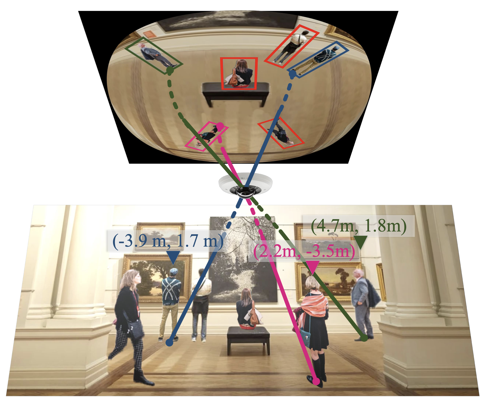

# Large-Scale Person Detection and Localization using Overhead Fisheye Cameras

This is the official pytorch implementation of our ICCV 2023 (oral) paper [LOAF-fisheye](https://arxiv.org/abs/2307.08252). 

Authors: Lu Yang*, Liulei Li*, Xueshi Xin, Yifan Sun, Qing Song, Wenguan Wang&dagger;

---

# Abstract
Location determination finds wide applications in daily life. Instead of existing efforts devoted to localizing tourist photos captured by perspective cameras, in this article, we focus on devising person positioning solutions using overhead fisheye cameras. Such solutions are advantageous in large field of view (FOV), low cost, anti-occlusion, and unaggressive work mode (without the necessity of cameras carried by persons). However, related studies are quite scarce,
due to the paucity of data. To stimulate research in this exciting area, we present LOAF, the first large-scale overhead fisheye dataset for person detection and localization. LOAF is built with many essential features, e.g., i) the data cover abundant diversities in scenes, human pose, density, and location; ii) it contains currently the largest number of annotated pedestrian, i.e., 457K bounding boxes with groundtruth location information; iii) the body-boxes are labeled
as radius-aligned so as to fully address the positioning challenge. To approach localization, we build a fisheye person detection network, which exploits the fisheye distortions by a rotation-equivariant training strategy and predict radiusaligned human boxes end-to-end. Then, the actual locations of the detected persons are calculated by a numerical solution on the fisheye model and camera altitude data. Extensive experiments on LOAF validate the superiority of our fisheye detector w.r.t. previous methods, and show that our whole fisheye positioning solution is able to locate all persons in FOV with an accuracy of 0.5 m, within 0.1 s.

# Model



# Usage
## Installation
We use the [DAB-DETR](https://github.com/IDEA-Research/DAB-DETR) and [Rotated IOU](https://github.com/lilanxiao/Rotated_IoU) projects as our codebase. You need to compile the deformable attention and minimal enclosing box operators manually.

We test our models under ```python=3.7.3,pytorch=1.9.0,cuda=11.1```. Other versions might be available as well.


1. Install needed packages
```sh
pip install -r requirements.txt
```

2. Compiling CUDA operators
```sh
cd models/dab_deformable_detr/ops
python setup.py build install
# unit test (should see all checking is True)
python test.py
cd ../../..
cd util/cuda_op
python setup.py install
cd ../..
```

## Data
Please download [LOAF](https://loafisheye.github.io/) dataset and organize them as following:
```
./data/loaf/
    ├── images
    │   └── resolution_1k
    │       ├── train
    │       ├── val
    │       └── test
    ├── annotations
    │   └── resolution_1k
    │       ├── instances_train.json
    │       ├── ...
    └───────└── instances_test.json

```


## Run


```sh
# person detection training
cd EQU_TRAIN
python -m torch.distributed.launch \
  --nproc_per_node=8 main.py \
  --two_stage \
  --finetune_early_layers 

# person detection evaluate
cd EQU_EVAL
python main.py -m dab_deformable_detr \
  --resume /path/to/our/checkpoint \ # replace the args to your checkpoint path
  --two_stage \
  --eval

# person localization evaluate
cooming soon
```


# Citation
```bibtex
@inproceedings{yang2023large,
  title={Large-Scale Person Detection and Localization using Overhead Fisheye Cameras},
  author={Yang, Lu and Li, Liulei and Xin, Xueshi and Sun, Yifan and Song, Qing and Wang, Wenguan},
  booktitle={ICCV},
  year={2023}
}
```